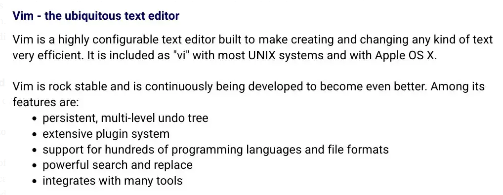

# Golang Awesome References

Go is a programming language created by Google in 2009. It is a statically-typed language with syntax similar to C, and it is designed for high-performance and concurrent programming. Go is commonly used for building web applications, distributed systems, and other types of software.

Some of the strong sides of Go language are:

- [x] Easy to learn and use - Go has a simple and clean syntax that is easy to learn and understand.
- [x] High performance - Go is a compiled language that produces fast and efficient code.
- [x] Scalability and concurrency - Go has built-in support for concurrency and parallelism, which allows it to handle large workloads and scale easily.
- [x] Robust standard library - Go has a comprehensive standard library that provides a wide range of features and functions for developing applications.
- [x] Strong community - Go has a large and active community of developers who contribute to the language and its ecosystem, providing support, tools, and resources for users.

- [Golang Awesome References](#golang-awesome-references)
  - [Web frameworks and libraries](#web)
    - [Gin Web Framework](#gin-web-framework)
    - [Echo](#echo)
    - [Beego](#beego)
    - [Buffalo](#buffalo)
    - [Revel](#revel)
    - [Gorilla Mux](#gorillamux)
    - [swag - Swagger](#swag---swagger)
    - [jwt-go](#jwt-go)
    - [Go-Protobuf](#go-protobuf)
  - [Dependency Injetion](#dependency-injetion)
    - [Wire: Automated Initialization in Go](#wire-automated-initialization-in-go)
  - [Database](#database)
    - [GORM](#gorm)
    - [Bun](#bun)
    - [Go-SQLite3](#go-sqlite3)
    - [Go-Redis](#go-redis)
  - [Kafka](#kafka)
    - [gogen-avro](#gogen-avro)
  - [IDE](#ide)
    - [GoLand](#goland)
    - [Visual Studio Code](#visual-studio-code)
    - [Sublime Text](#sublime-text)
    - [Vim](#vim)
  - [Clouds](#clouds)
    - [Amazon Web Services](#amazon-web-services)
    - [Microsoft Azure](#microsoft-azure)
    - [Google Cloud Platform](#google-cloud-platform)
    - [Heroku](#heroku)
    - [DigialOcean](#digitalocean)
  - [Resources](#resources)
    - [Go by Example](#go-by-example)
    - [Go Tour](#go-tour)
    - [GoDoc](#godoc)
    - [The Go Programming Language](#the-go-programming-language)
    - [Go Blog](#go-blog)
  - [Mentors](#mentors)
    - [Rob Pike](#rob-pike)
    - [Russ Cox](#russ-cox)
    - [Ian Lance Taylor](#ian-lance-taylor)
    - [Dave Cheney](#dave-cheney)
    - [Mat Ryer](#mat-ryer)
  - [Mentions](#mentions)
  
## Web

### [Gin Web Framework](https://github.com/gin-gonic/gin)

> Gin is a web framework written in Go (Golang). It features a martini-like API with performance that is up to 40 times faster thanks to httprouter. If you need performance and good productivity, you will love Gin.

### [Echo](https://github.com/labstack/echo)

> High performance, minimalist Go web framework

### [Beego](https://beego.vip)

> Beego is a full-stack web framework for building web applications and services. It provides a range of features and tools for developing web applications quickly and easily.

### [Buffalo](https://gobuffalo.io/#)

> Buffalo is a full-stack web development framework for building web applications and services. It provides a range of tools and features for developing web applications with Go.

### [Revel](https://revel.github.io/)

> Revel is a high-performance web framework for building APIs and web applications. It offers a simple and flexible API for developing web applications with Go.

### [gorilla/mux](https://github.com/gorilla/mux)

> Package gorilla/mux implements a request router and dispatcher for matching incoming requests to their respective handler.
> The name mux stands for "HTTP request multiplexer". Like the standard http.ServeMux, mux.Router matches incoming requests against a list of registered routes and calls a handler for the route that matches the URL or other conditions.

### [swag - Swagger](https://github.com/swaggo/swag)

> Swag converts Go annotations to Swagger Documentation 2.0. We've created a variety of plugins for popular [Go web frameworks](https://github.com/swaggo/swag#supported-web-frameworks). This allows you to quickly integrate with an existing Go project (using Swagger UI).

### [jwt-go](https://github.com/golang-jwt/jwt)

> A go (or 'golang' for search engine friendliness) implementation of JSON Web Tokens.

### [Go-Protobuf](https://github.com/golang/protobuf)

> Go-Protobuf is a Protocol Buffers library for Go that provides a simple and straightforward API for encoding and decoding Protocol Buffers messages in Go.

## Dependency Injetion

### [Wire: Automated Initialization in Go](https://github.com/google/wire)

> Wire is a code generation tool that automates connecting components using dependency injection. Dependencies between components are represented in Wire as function parameters, encouraging explicit initialization instead of global variables. Because Wire operates without runtime state or reflection, code written to be used with Wire is useful even for hand-written initialization.
> For an overview, see the [introductory blog post](https://go.dev/blog/wire).

## Database

### [GORM](https://gorm.io/)

> The fantastic ORM library for Golang
> * Full-Featured ORM
> * Associations (has one, has many, belongs to, many to many, polymorphism, single-table inheritance)
> * Hooks (before/after create/save/update/delete/find)
> * Eager loading with Preload, Joins
> * Transactions, Nested Transactions, Save Point, RollbackTo to Saved Point
> * Context, Prepared Statement Mode, DryRun Mode
> * Batch Insert, FindInBatches, Find/Create with Map, CRUD with SQL Expr and Context Valuer
> * SQL Builder, Upsert, Locking, Optimizer/Index/Comment Hints, Named Argument, SubQuery
> * Composite Primary Key, Indexes, Constraints
> * Auto Migrations
> * Logger
> * Extendable, flexible plugin API: Database Resolver (multiple databases, read/write splitting) / Prometheus…
> * Every feature comes with tests
> * Developer Friendly

### [Bun](https://bun.uptrace.dev)

> Lightweight Golang ORM for PostgreSQL, MySQL, MSSQL, and SQLite.
> * SQL-first: Bun's goal is to help you write SQL, not to hide it behind awkward constructs.
> * sql.DB compatible: Bun uses database/sql and extends it in a compatible and idiomatic way.
> * Database-agnostic: Out-of-the box works with PostgreSQL, MySQL 5.7+, MSSQL, and SQLite.
> * Migrations: Keep your database schema updated with Go and SQL-based migrations.
> * Fixtures: Provide initial data for your application with YAML fixtures.
> * Starter kit: Modern app skeleton puts everything together and helps you get started.

### [Go-SQLite3](https://github.com/mattn/go-sqlite3)

> Go-SQLite3 is a SQLite3 driver library for Go that provides a simple and straightforward API for working with SQLite3 databases from Go.

### [Go-Redis](https://github.com/go-redis/redis)

> Go-Redis is a Redis client library for Go that provides a simple and straightforward API for working with Redis from Go.

## Kafka

### [gogen-avro](https://github.com/actgardner/gogen-avro)

> Generates type-safe Go code based on your Avro schemas, including serializers and deserializers that support Avro's schema evolution rules. Also supports deserializing generic Avro data (in beta).

---

## IDE

### [GoLand](https://www.jetbrains.com/go/)

> GoLand is a dedicated Go language IDE developed by JetBrains. It offers a range of features and tools for developing and debugging Go applications, including code completion, refactoring, and error detection.

### [Visual Studio Code](https://code.visualstudio.com/)

> Visual Studio Code is a popular open-source code editor that supports Go development through its Go extension. It offers a range of features for developing Go applications, including code completion, linting, and debugging.

### [Sublime Text](https://www.sublimetext.com/)

> Sublime Text is a popular text editor that supports Go development through its GoSublime package. It provides a range of features for developing Go applications, including code completion, linting, and debugging.

### [Vim](https://www.vim.org/)

> Vim is a popular text editor that supports Go development through its vim-go plugin. It provides a range of features for developing Go applications, including code completion, linting, and debugging.

---

## Clouds

Many cloud providers support Go language, including

### Amazon Web Services

> AWS offers a range of services and tools for developing and deploying Go applications on its cloud platform, including Elastic Beanstalk, EC2, and Lambda.

### Microsoft Azure

> Azure offers a range of services and tools for developing and deploying Go applications on its cloud platform, including App Service, Functions, and Kubernetes.

---

### Google Cloud Platform

> GCP offers a range of services and tools for developing and deploying Go applications on its cloud platform, including App Engine, Compute Engine, and Kubernetes Engine.

### Heroku

> Heroku is a cloud platform that offers support for Go applications through its Cedar-14 stack. It provides a simple and straightforward way to deploy and manage Go applications on the cloud.

### [DigitalOcean](https://www.digitalocean.com/)

> [DigitalOcean](https://www.digitalocean.com/) offers a range of services and tools for developing and deploying Go applications on its cloud platform, including Droplets, Kubernetes, and App Platform.

---

## Resources

Some of the best websites to learn Go language are

### [Go by Example](https://gobyexample.com/)

> Go by Example is a website that provides a range of Go language examples and tutorials. It covers a wide range of topics and features interactive code examples that can be edited and executed in the browser.

### [Go Tour](https://go.dev/tour/welcome/1)

> Go Tour is an interactive website that provides an introduction to Go language concepts and features. It includes a range of exercises and quizzes that can help users learn Go language in a fun and engaging way.

### [GoDoc](https://go.dev/doc/)

> GoDoc is a website that provides comprehensive documentation for the Go language and its standard library. It includes detailed explanations, examples, and reference materials for Go language concepts and features.

### [The Go Programming Language](https://www.gopl.io/)

> The Go Programming Language is a book by Alan A. A. Donovan and Brian W. Kernighan that provides a comprehensive introduction to Go language concepts and features. It is available for free on the web and can be an excellent resource for learning Go language.

### [Go Blog](https://go.dev/blog/)

> Go Blog is the official blog of the Go language team. It features a range of articles, tutorials, and resources that can help users learn Go language and stay up-to-date with the latest developments in the language and its ecosystem.

---

## Mentors

Some of the most famous Go language programmers are

### [Rob Pike](https://en.m.wikipedia.org/wiki/Rob_Pike)

> Rob Pike is one of the co-creators of Go language and a former member of the Go language team at Google. He is also the co-author of The Go Programming Language book and a well-known figure in the Go community.

### [Russ Cox](https://swtch.com/~rsc/)

> Russ Cox is a former member of the Go language team at Google and the current director of research at the Software Freedom Conservancy. He has made significant contributions to Go language and its ecosystem, including the development of the Go build tool.

### Ian Lance Taylor

> Ian Lance Taylor is a former member of the Go language team at Google and the author of the Go in Practice book. He is a well-known figure in the Go community and has made significant contributions to Go language and its ecosystem.

### [Dave Cheney](https://dave.cheney.net/)

> Dave Cheney is a well-known figure in the Go community and the author of the Go Proverbs blog. He has made significant contributions to Go language and its ecosystem, including the development of popular Go libraries and tools.

### [Mat Ryer](https://medium.com/@matryer)

> Mat Ryer is a well-known figure in the Go community and the founder of the GoBridge and GoLearn organizations. He has made significant contributions to Go language and its ecosystem, including the development of popular Go libraries and tools.

---

## Mentions

So that I could compile this material I have used some references that I need to mention here.

- [Go Language Guide: Frameworks, Libraries, IDE, Clouds, Resources, Mentors](https://tomaszs2.medium.com/go-guide-frameworks-libraries-ide-clouds-resources-mentors-a97e17268d7e)
